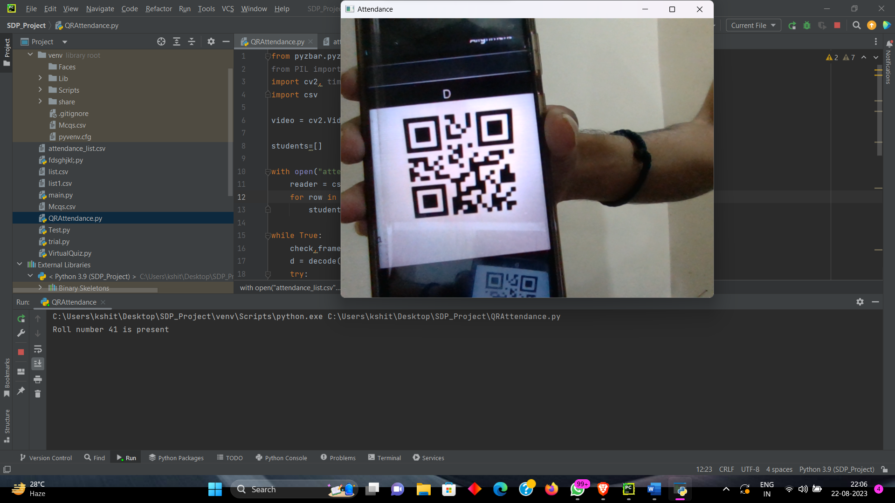
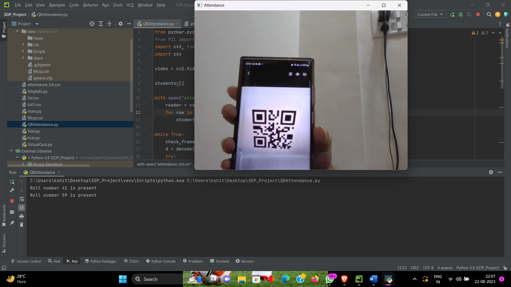

# QR Code Attendance System

This project is a QR Code Attendance System built using Python, OpenCV, and the pyzbar library. It allows for real-time scanning of QR codes from a webcam to track student attendance based on a CSV file containing student roll numbers.

## Features

- Real-time QR code scanning using a webcam
- Attendance tracking by matching scanned QR codes with a predefined list
- Displays present students

## Requirements

To run this project, you'll need the following:

- Python
- OpenCV
- pyzbar
- Pillow (PIL)
- CSV module (included in Python standard library)

You can install the required libraries using pip:

```bash
pip install opencv-python pyzbar Pillow
```


# OUTPUT




